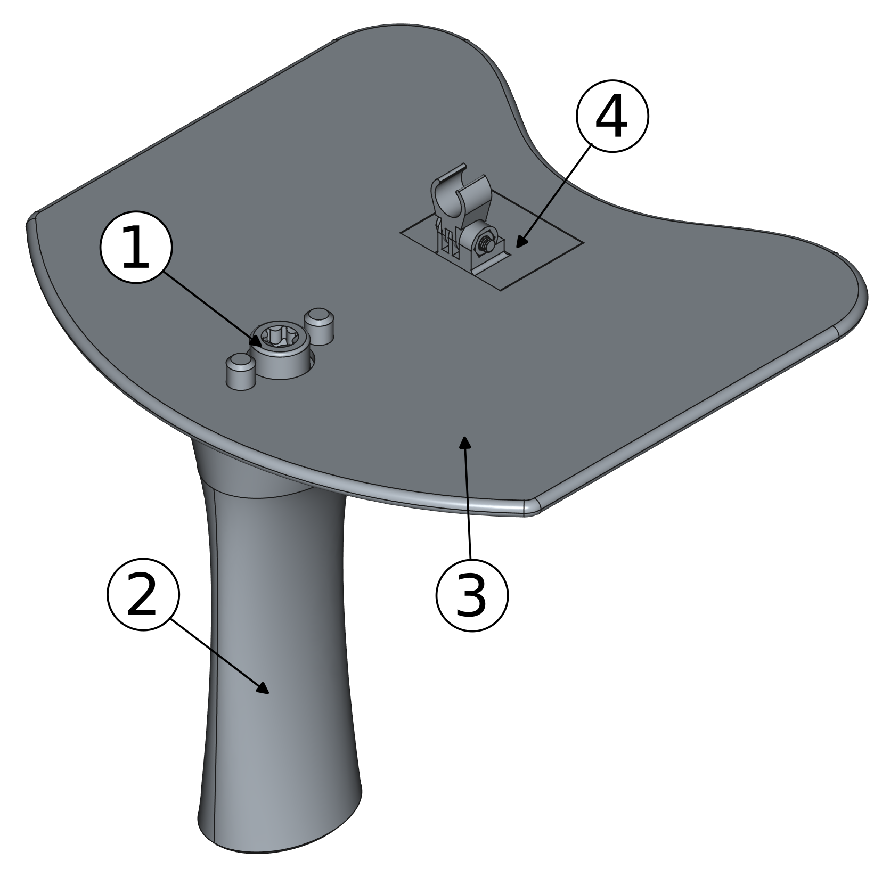
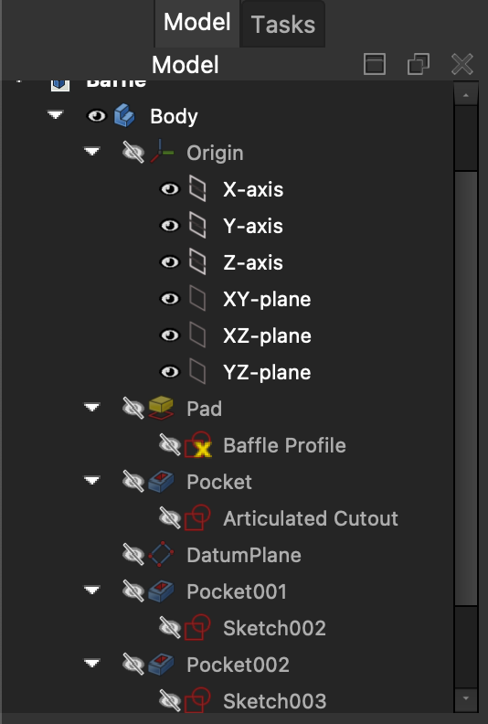
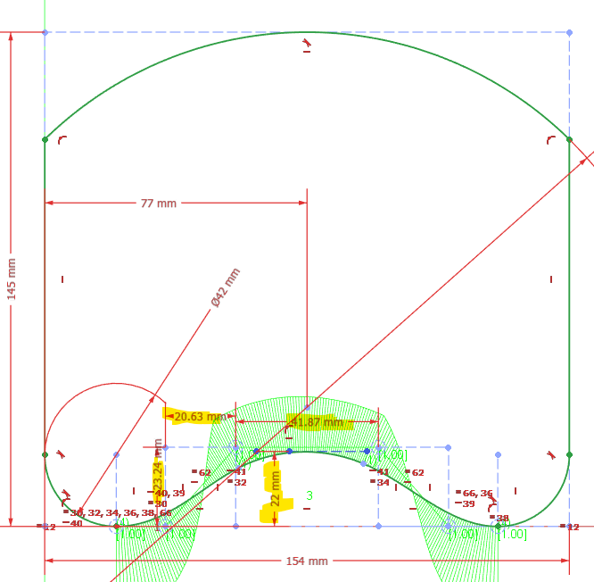
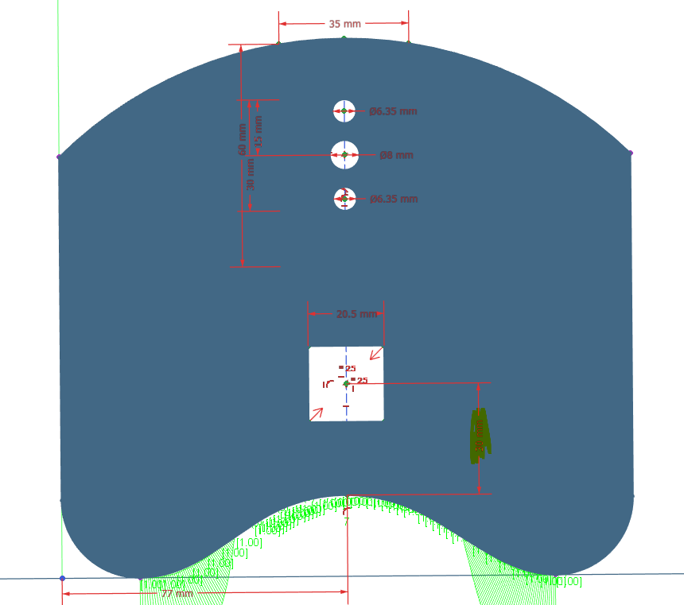
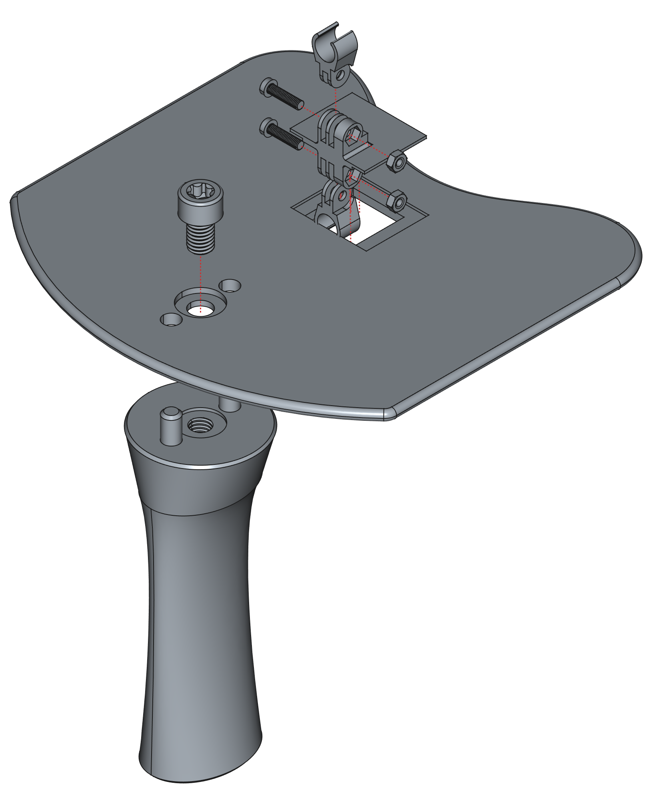
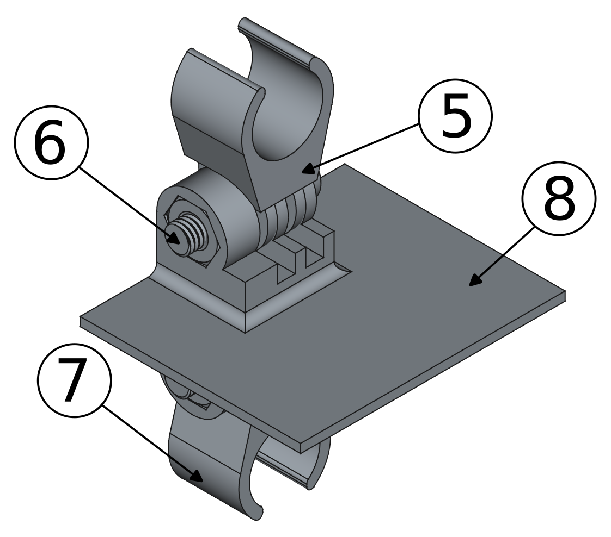
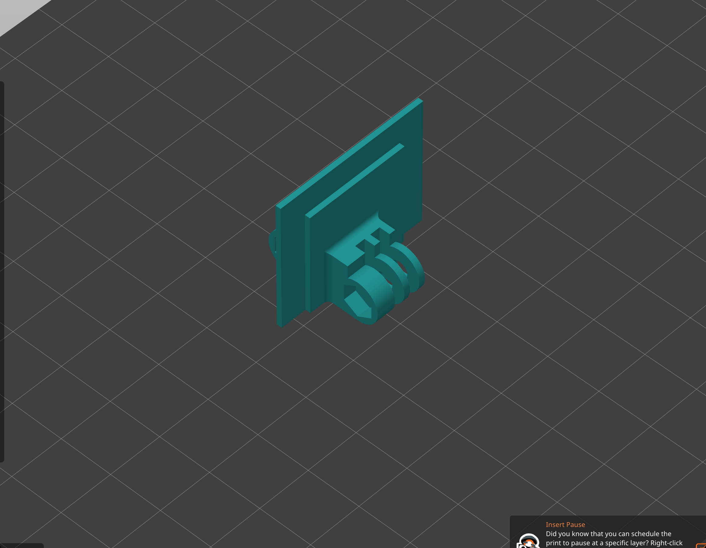
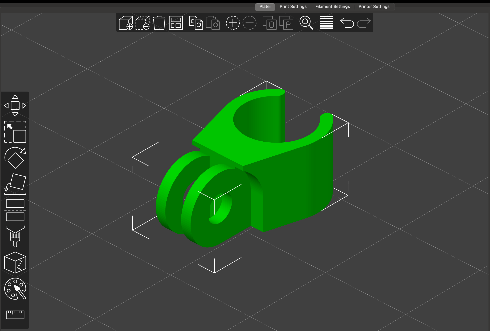

# Nosey

`Nosey` is the **N**asalance **O**pen **S**ource **E**stimation s**Y**stem. It is an open-source hardware platform for collecting acoustic nasalance data.

If you use this in your research please cite the following paper, which also contains more information on the set-up, validation, and customization of the system:

* Dewhurst, Maya, Jack Collins, Justin J. H. Lo, Roy Alderton & Sam Kirkham. 2025. Nosey: Open-source hardware for acoustic nasalance. *Proceedings of Interspeech 2025*. https://doi.org/10.48550/arXiv.2505.23339

The version described in the paper is `v1.0.0`. This and any future versioned releases are archived via Zenodo: https://doi.org/10.5281/zenodo.15543852

## 3D Files

These files were created (and can be edited) using FreeCAD version 1.0, which is open-source software that can be downloaded at: https://www.freecad.org

We have provided files in two formats:

- `.3mf`: 3D Manufacturing Format files, which can be used for 3D printing.
- `.FCStd`: FreeCAD files that can be edited and adapted for further customization.

The system comprises 4 primary parts, and an assembly file. The microphone holder was designed for AKG CK99L microphones, but it is possible to adapt these for different microphones.

### Parts List

3D printed parts:

- Handle x1 (2)
- Articulated Mic Plate x1 (4)
- Mic Holder x 2 (5 - in assembly guide section)
- Baffle x 1 (3)

Hardware:

- M3 nut and bolt 12 mm long x 2
- M8 Bolt 12mm long x 1 
- Coating for sealing the plastic

### Baffle Modification

To modify the shape of the baffle modify the **Baffle Profile** sketch, to change the position of the cutout for the articulated dual-microphone holder, modify the **Articulated Cutout** sketch.

The **Baffle Profile** sketch allows you to change the shape of the profile that pushes up against the subject's face. The following highlighted dimensions are a good place to start with the modifications:

To modify the position of the cutout for the articulated microphone plate, and thus, the distance from the front of the baffle, edit the **Articulated Cutout** sketch:

### Assembly Guide

The exploded diagram below shows how the device fits together:

The M3 nuts can be pushed into the microphone plate hexagonal pockets. Depending on the precision of your 3D printer you may need to adjust the size of these holes. The M3 nuts can be seen below, the bolt is sticking out of the nut highlighted by bubble 6.

The flat edge of the microphone holder should line up with the flat edge of the articulated microphone plate holder.

### Printing Recommendations

The microphone holder and articulated microphone plate have been designed to be printed in the following way:

