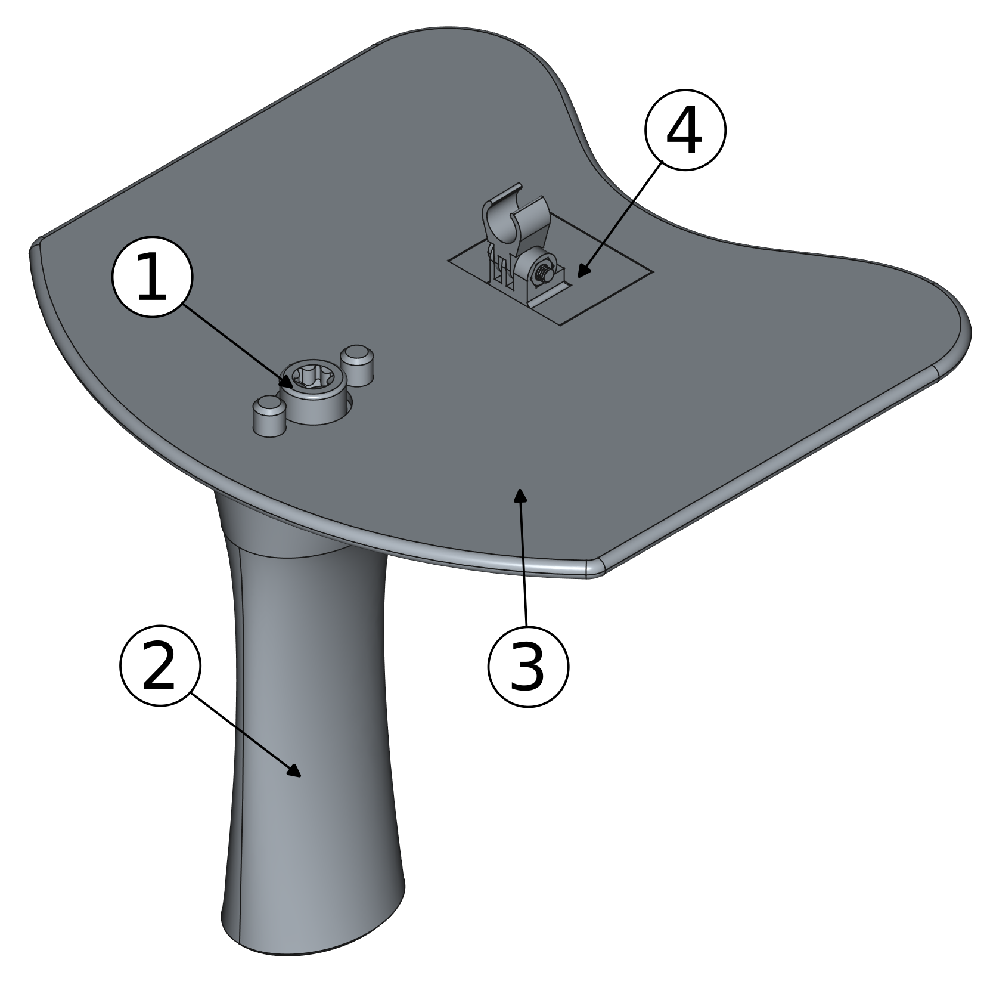
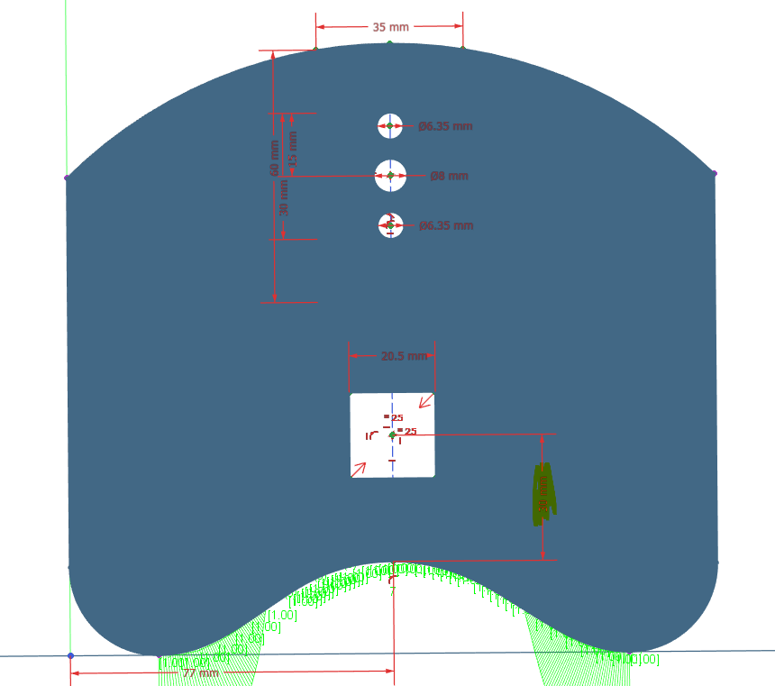
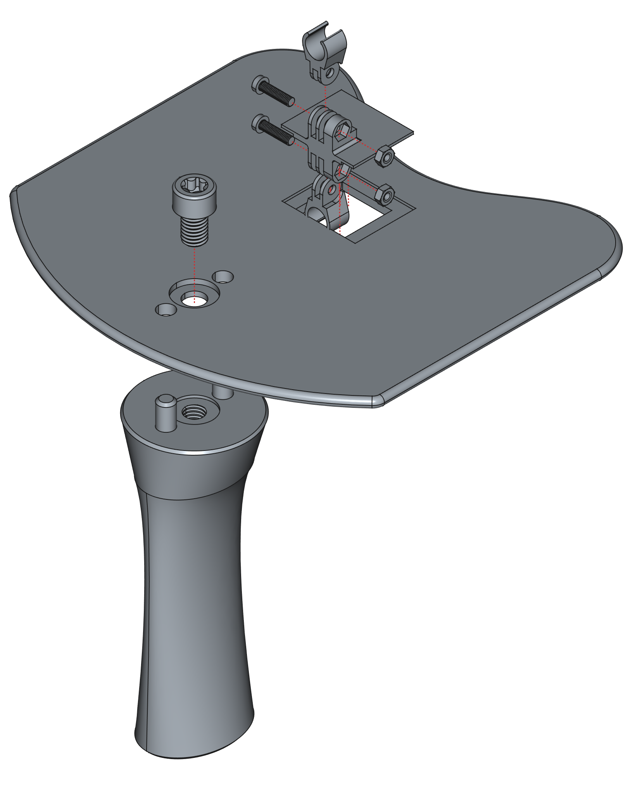
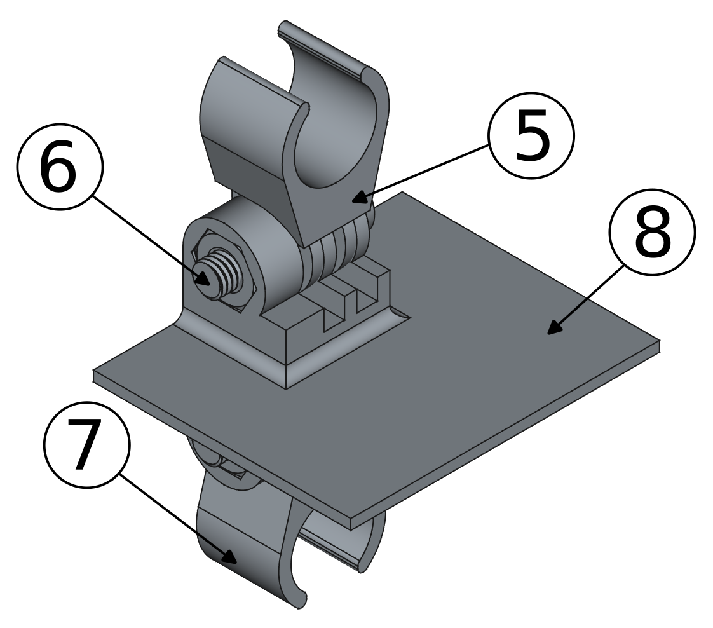

# Nosey

Open-source hardware for acoustic nasalance.

If you use this in your research please cite the following paper, which also contains more information on the set-up, validation, and customization:

* Dewhurst, Maya, Jack Collins, Justin J. H. Lo, Roy Alderton & **Sam Kirkham**. 2025. Nosey: Open-source hardware for acoustic nasalance. *Proceedings of Interspeech 2025* 1-5. [[arXiv]]()

## 3D Files

These were created in FreeCAD version 1.0, there are 4 primary parts, and an assembly file. 

The microphone holder was designed for AKG CK99L microphones.

### Parts List

3D printed parts:

- Handle x1 (2)
- Articulated Mic Plate x1 (4)
- Mic Holder x 2 (5 - in assembly guide section)
- Baffle x 1 (3)

Hardware:

- M3 nut and bolt 12 mm long x 2
- M8 Bolt 12mm long x 1 
- Coating for sealing the plastic

### Baffle Modification

To modify the shape of the baffle modify the Baffle Profile sketch, to change the position of the cutout for the articulated holder, modify the articulated cutout sketch.

The Baffle Profile sketch allows you to change the shape of the profile that pushes up against the subject's face. The following highlighted dimensions are a good place to start with the modifications:

To modify the position of the cutout for the articulated mic plate, and thus, the distance from the front of the baffle, edit the articulated cutout sketch:

### Assembly Guide

The exploded diagram below shows how the device fits together:

The M3 nuts can be pushed into the microphone plate hexagonal pockets. Depending on the precision of your 3D printer you may need to adjust the size of these holes. The M3 nuts can be seen below, the bolt is sticking out of the nut highlighted by bubble 6.

The flat edge of the microphone holder should line up with the flat edge of the articulated microphone plate holder.

### Printing Recommendations

The microphone holder and articulated microphone plate have been designed to be printed in the following way:

